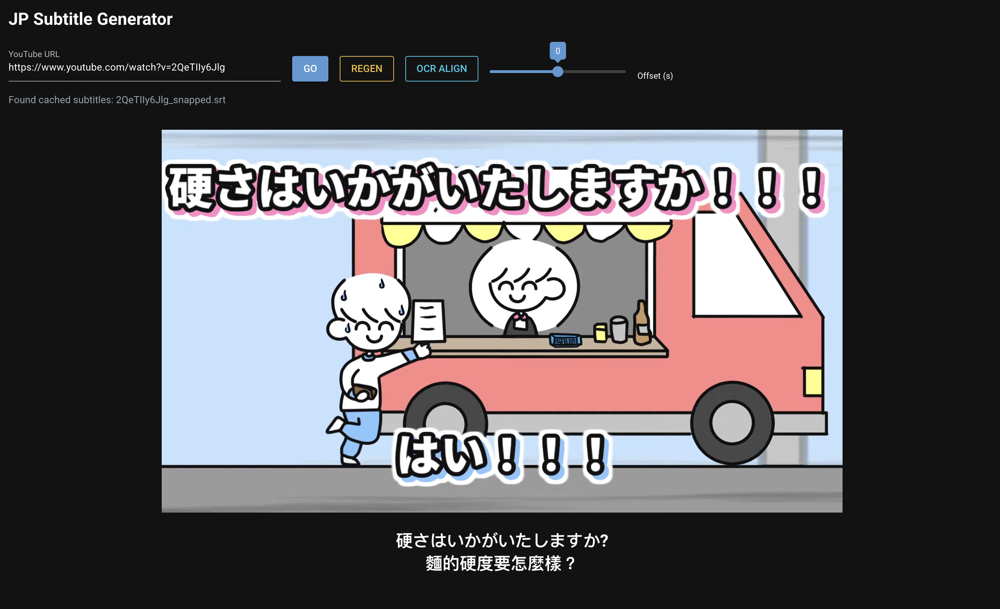

# jp-subtitle-generator

**Bilingual subtitle generator for Japanese YouTube videos — Whisper for content, OCR for timing, Claude for translation, built in a single agentic session.**

> Paste a YouTube URL. Get synced Japanese + Traditional Chinese subtitles. One button. Built by a [Claude Code](https://claude.ai/claude-code) agent across one long evening session — 13 commits, 5 pipeline iterations, 2 OCR engines benchmarked, 1 pixel-matched font identified.

---

## The Problem

Japanese comedy animation channels like [Bokuwata](https://www.youtube.com/@BokuwataChannel) burn subtitles directly into the video — no CC track, no community subs. YouTube's auto-generated captions are garbage. Overseas fans can't follow along.

I wanted: paste a URL, get accurate bilingual subtitles, watch in the browser.

## The Pipeline

```
YouTube URL
    → yt-dlp (download)
    → Whisper medium (transcribe Japanese, ~1x realtime)
    → [optional] PP-OCR mobile (timing alignment for drift)
    → claude -p (translate to Traditional Chinese)
    → Bilingual SRT
    → NiceGUI viewer with YouTube embed
```

For short videos (~1 min): Whisper alone, 80 seconds end-to-end.
For long videos (~10 min): Whisper + OCR alignment, fixes timestamp drift.

## The Viewer

A NiceGUI web app at `localhost:8089`:

- **Go** — paste URL, auto-loads cached subs or generates new with progress bar
- **Regen** — delete cache, re-run from scratch
- **OCR Align** — re-anchor timestamps using visual text detection (for when Whisper drifts)
- **Offset slider** — instant ±5s manual adjustment during playback

## Usage

```bash
# Setup
python3.12 -m venv venv && source venv/bin/activate
pip install nicegui openai-whisper paddleocr paddlepaddle torch

# Run
python sub_viewer.py
# Open http://localhost:8089
```

Requires `claude` CLI for translation (`claude -p`). Requires `yt-dlp` for downloads.

## Stats

- **10+ videos** subtitled across development and testing
- **206 subtitle lines** aligned for a 10-minute video (bomb timer sketch)
- **60 subtitle lines** per 1-minute video (kitchen car sketch)
- **Whisper medium**: ~95% content accuracy on Japanese comedy dialogue
- **PP-OCR mobile**: ~95% accuracy on standard anime subtitles
- **Processing speed**: ~1-2x realtime on M4 MacBook Air (CPU)

## Side Quest: Pixel-Matched Text Renderer

I reverse-engineered Bokuwata's exact text style from screenshots:

- **Font**: Noto Sans JP Black (weight=900)
- **Layers**: white fill → black outline (9px) → colored drop shadow (9px offset 135°, no expansion) → white border (9px)
- **Shadow colors**: pink `#FC8DC2` (Speaker A) / blue `#8EC6FD` (Speaker B)
- **Pixel match**: IoU 0.91 against real screenshots

This renderer generates synthetic training data for a visual text detector — 1,200 labeled images with anime-style distractors as hard negatives. The detector achieves mAP50=0.99 with zero false positives on real video frames.

Speaker separation comes for free: k-means clustering on detected text region hues automatically identifies which speaker said what — works on any channel with colored subtitles.

*(The visual detector uses ultralytics/YOLO (AGPL-3.0) and lives in a [separate private repo](https://github.com/evnchn/jp-subtitle-devwork).)*

## How I Got Here

The agent went through **5 major iterations** before landing on the current pipeline:

| Version | Approach | Result |
|---|---|---|
| v1 | PP-OCR server on every frame | 13 min for 71s video, garbled kanji |
| v2 | Frame diffing + PP-OCR | Still slow, inconsistent boxes |
| v3 | manga-ocr on zone crops | Fast but hallucinated aggressively |
| v4 | manga-ocr + consistency voting | Eliminated hallucinations, but 50% kanji errors |
| **v5** | **PP-OCR mobile on raw zones** | **1s/frame, correct kanji** — mobile model secretly beats server |

Then the breakthrough: **Whisper medium handles 97% of the content**. OCR was demoted to timing alignment.

The final discovery — PP-OCR mobile reads `辛` (spicy) correctly where every other engine read `年` (year) or `早` (early). A model 8x smaller gave better accuracy on stylized text. Nobody expected that.

Other things I tried along the way:
- **Binarization / morphology / color extraction** on video frames — all made OCR worse, not better
- **Connected component grouping** via dark outlines — unreliable, outlines merge unpredictably
- **Frame differencing** to isolate text changes — animation moves constantly, diff is too noisy
- **Shadow color detection** (black→pink/blue→white sandwich at 135°) — finds text but too many false positives without the trained YOLO model

## License

CC BY-NC-SA 4.0 — see [LICENSE](LICENSE)

## Overnight Findings (2026-04-09)

### Multi-AI Round Table
Tested 3 models reading the same frames:

| Model | 豚骨ラーメンと | これで！！！ | すみません (3 lines) |
|---|---|---|---|
| Gemini Flash | ✓ | ✓ | ✓✓✓ |
| Llama Maverick | ✓ | ✓ | ✓ (mangled !) |
| GPT-4.1 mini | ✓ | ✓ | ✓✓✓ |

All 3 read text PP-OCR couldn't. Multi-model adds redundancy at ~3x cost.

### Combined Pipeline (Binary Search + Gemini + Translate)
Tested on 2 videos:

| Video | Subs | Translated | Gemini calls | Time | Speaker tags |
|---|---|---|---|---|---|
| Kitchen car (71s) | 85 | 85 | 69 | 325s | pink/blue ✓ |
| Strike zone (93s) | 44 | 44 | 52 | 239s | pink/blue ✓ |

33ms timing precision via binary search on frame diffs. ~$0.007 per video.

### Whisper Model Benchmark (MariMariMarie GT)

| Model | Speed | Timing mean | Timing p90 | Drift |
|---|---|---|---|---|
| **base** | 10x faster | **84ms** | **140ms** | 0.02s |
| small | 4x faster | 114ms | 270ms | -0.3s |
| medium | 1.7x faster | 383ms | 830ms | -0.2s |
| turbo | 2.5x faster | 227ms | 520ms | -0.02s |

Smaller models = better timing. Base is the sweet spot.
